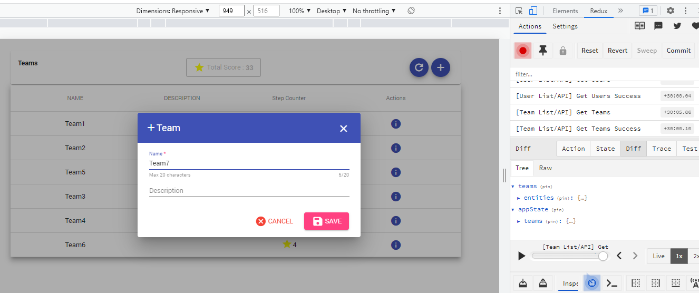

# APSIS coding assignment full stack
You will find the coding assignment in the [Assignment.md](Assignment.md) file.

# For running the project :

1 ) You must enter frontend folder and run ng server (http://127.0.0.1:4200)

1 ) You must enter backend folder and run npm run start:dev (http://127.0.0.1:7000)

And finally you can enter (http://127.0.0.1:4200) in browser url and go on . 

*Note => The client is connected by Server.url file ( it is in frondend.../shared/urls folder ) to backend url(...:7000)

## More Information and View of project

 - [Back End](backend-nodejs-express/README.md)

 - [Frond End Angular8](frontend-angular8/README.md)

 - [Frond End Angular13/NGRX](frontend/README.md)

