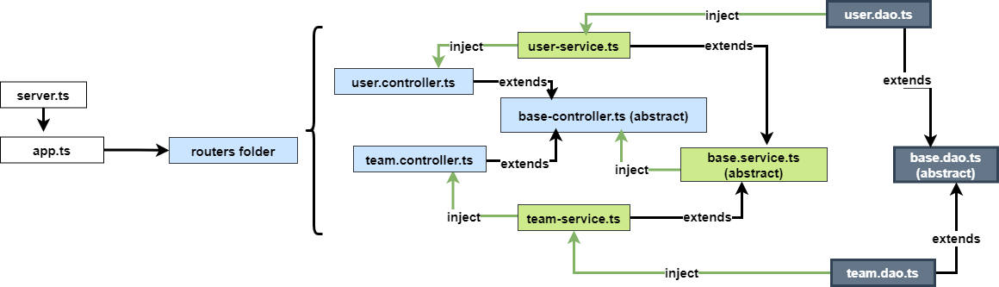

# BackendNodejsExpress
This project was generated with :

- Typescript 4.6
- Nodejs
- Express4

## For running the project use the following commands:

### Install Dependencies
```shell
npm i
```

### Development server
Run `npm run start:dev` for a dev server. Navigate to `http://localhost:7000/` (otherwise navigate to port 8002). The app will automatically reload if you change any of the source files.

## Build
Run `npm run build`  or `npm run prod` to build the project. The build artifacts will be stored in the `dist/` directory. Use the `--prod` flag for a production build.

## Running unit tests
Run `npm run test` to execute the unit tests via [Karma](https://karma-runner.github.io).


## Relationship between components

The following pictures display the structure and flows in project :  


