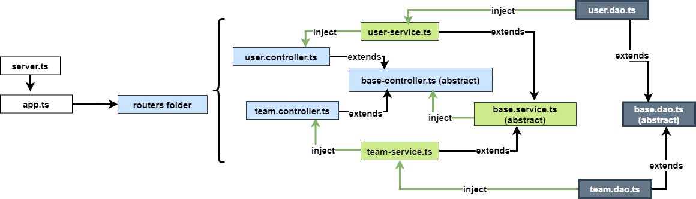

# BackendNodejsExpress

Backend implementation of the leaderboard assignment built with **Node.js**, **TypeScript**, and **Express 4**.

This service exposes a REST API for managing teams, users, and step counters.  
It is designed according to the assignment requirement that data only needs to persist **during application runtime**.

---

## Built With

[](https://nodejs.org/)
[](https://www.typescriptlang.org/)
[](https://expressjs.com/)

---

## Overview

The backend provides the core API for the leaderboard application.

It supports:

- creating teams
- creating users within teams
- incrementing user/team counters
- retrieving current totals
- listing all teams and their step counts

The application uses **in-memory storage**, which means all data is reset when the server restarts.

---

## Project Structure
```
src
├── controllers
├── interfaces
├── models
├── routers
└── services
```
### Structure Notes

- **controllers**  
  Handle HTTP requests and responses

- **interfaces**  
  Define TypeScript contracts for entities and payloads

- **models**  
  Represent data structures used in the application

- **routers**  
  Register API routes and connect them to controllers

- **services**  
  Contain business logic for teams, users, and counters

---

## Run Locally

Install dependencies

bash
npm install

Start development server

bash
npm run start:dev

Default URL:

bash
http://localhost:7000/

In some environments, the fallback may use another configured port such as `8002`.

---

## Development

| Command | Description |
| :------ | :---------- |
| `npm run start:dev` | Start the backend in development mode with auto-reload |
| `npm run build` | Compile TypeScript into the `dist/` directory |
| `npm run start` | Run the compiled production build |
| `npm run prod` | Build the project and start the compiled server |
| `npm run test` | Placeholder test command |

---

## Technical Notes

- Built with **Express 4**
- Written in **TypeScript 4.6**
- Uses **CORS** for frontend-backend communication
- Uses **Helmet** for common HTTP security headers
- Uses **dotenv** for environment support
- Uses **express-session** where session handling is required
- Uses **in-memory storage** to satisfy the assignment requirements

---

## Architecture Diagram

The following diagram shows the backend structure and flow:



---

## Assignment Compliance

This backend implementation addresses the assignment requirements by:

- exposing a REST-style API
- allowing multiple clients to consume the service
- handling team and user step counter operations
- keeping the architecture modular and maintainable
- remaining simple to build and run locally

---

GitHub: [sarlakZM](https://github.com/sarlakZM)

