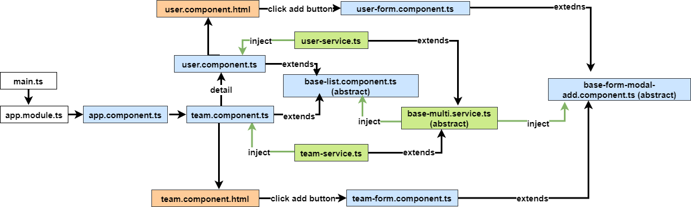

# FrontendAngular8

Angular 8 frontend implementation of the leaderboard assignment.

This application provides the user interface for managing teams, users, and step counters using the backend API.  
It follows the original assignment requirement to implement the frontend with **Angular 8** and uses **Angular Material**, **SCSS**, and standard Angular service-based architecture.

---

## Built With

[](https://angular.io/)
[](https://www.typescriptlang.org/)
[](https://material.angular.io/)
[](https://sass-lang.com/)
[](https://karma-runner.github.io/)
[](https://jasmine.github.io/)

---

## Overview

This frontend covers the required user stories:

- list all teams
- view team details
- add a new team
- list users in a team
- increment each user's step counter
- add a new user with a step counter

It communicates with the backend API and provides a responsive, structured Angular UI.

---

## Features

- Team leaderboard view
- Team detail view
- Add team form
- Add user form
- Increment step counters
- Angular Material UI components
- SCSS-based styling
- Shared services and reusable components
- Unit testing with Jasmine and Karma

---

## Project Structure
```bash
app
├── core
│   └── page-not-found
├── leaderboard
│   ├── team
│   │   └── team-form
│   └── user
│       └── user-form
└── shared
├── api
├── component
│   └── toast
├── model
├── pipe
├── service
├── support
└── url

assets
environments
styles
```
### Structure Notes

- **core**  
  Core application-level features such as fallback routes

- **leaderboard/team**  
  Team-related pages and form handling

- **leaderboard/user**  
  User-related pages and form handling

- **shared**  
  Shared API calls, services, models, pipes, utilities, and reusable UI parts

---

## Run Locally

Install dependencies

bash
npm install

Start development server

bash
npm run start

Navigate to:

bash
http://localhost:4200/

> Make sure the backend server is running before using the application.

---

## Development

| Command | Description |
| :------ | :---------- |
| `npm run start` | Start the Angular 8 development server |
| `npm run build` | Build the project for production |
| `npm run test` | Run unit tests with Karma |
| `npm run lint` | Run Angular lint checks |
| `npm run e2e` | Run end-to-end tests |

---

## Technical Notes

- Built with **Angular CLI 8.3.29**
- Uses **TypeScript 3.5**
- Uses **Angular Material** for UI components
- Uses **SCSS** for styling
- Uses **RxJS** for asynchronous operations
- Uses **ngx-toastr** for notifications

---

## Architecture Diagram

The following diagram shows the frontend structure and component relationships:



---

## Assignment Compliance

This implementation satisfies the frontend requirements by providing:

- team list view
- team detail view
- user management
- increment counter actions
- Angular-based architecture
- SCSS styling
- unit testing support
