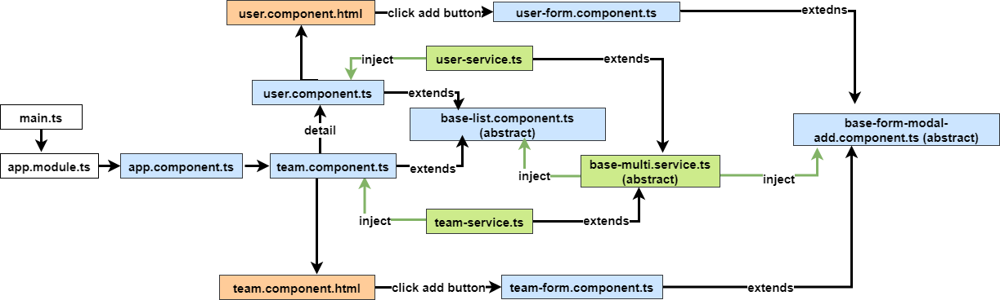

# Frontend
- This project was generated with [Angular CLI](https://github.com/angular/angular-cli) version 13.3.2.
- Typescript 4.6
- Styling with  [Material Angular](https://material.angular.io/) based on SCSS
- Testing with Jasmin + Karma

### Some Features
- Using reactive form
- Project structure and separate feature modules
- Using models and interfaces
- Error handling
- Reactive programming (RXJS) for working with api data
- Environment variables for using dynamic data in production or development
- angular tech stack e.g. pipe, dependency injection, directive
- An initial unittest for some sections
- Using NGRX for showing total store 

    
## For running the project use the following commands:

### Install Dependencies
```shell
npm i
```

### Development server
Run `ng serve` for a dev server. Navigate to `http://localhost:4200/`. The app will automatically reload if you change any of the source files.

### Build
Run `ng build` to build the project. The build artifacts will be stored in the `dist/` directory. Use the `--prod` flag for a production build.

### Running unit tests
Run `ng test` to execute the unit tests via [Karma](https://karma-runner.github.io).


## Relationship between components

The following pictures display the structure and flows in project :  


