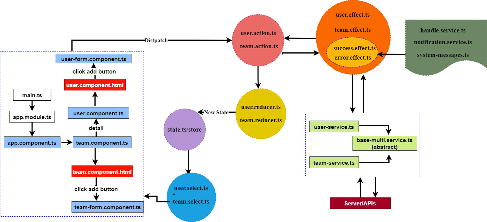
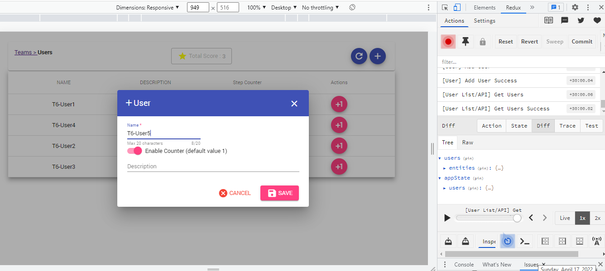

# Frontend
- This project was generated with [Angular CLI](https://github.com/angular/angular-cli) version 13.3.2.
- Typescript 4.6
- [Ngrx](https://ngrx.io/guide/store) && [Rxjs](https://rxjs.dev/guide/overview)
- Styling with  [Angular Material](https://material.angular.io) based on SCSS
- Testing with Jasmin + Karma

### Some Features
- Using reactive form
- Project structure and separate feature modules
- Using models and interfaces
- Better Error and Messages handling
- Reactive programming (RXJS && NGRX) for working with api data
- Environment variables for using dynamic data in production or development
- angular tech stack e.g. pipe, dependency injection, directive, ngrx, jasmin, rxjs
- An initial unittest for most sections
- @ngrx/store-devtools - library for showing devtools in browser (Redux DevTools Extensions
)

## For running the project use the following commands:

### Install Dependencies
```shell
npm i
```

### Development server
Run `ng serve | npm run start` for a dev server. Navigate to `http://localhost:4200/`. The app will automatically reload if you change any of the source files.

### Build
Run `ng build | npm run build` to build the project. The build artifacts will be stored in the `dist/` directory. Use the `--prod` flag for a production build.

### Running unit tests
Run `ng test | npm run test` to execute the unit tests via [Karma](https://karma-runner.github.io).


## Relationship between components

The following pictures display the structure and flows in project :  




