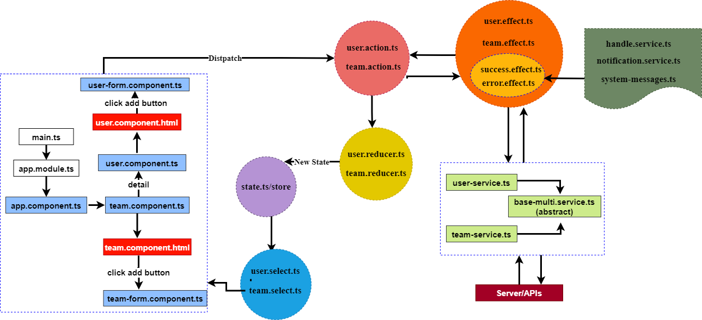
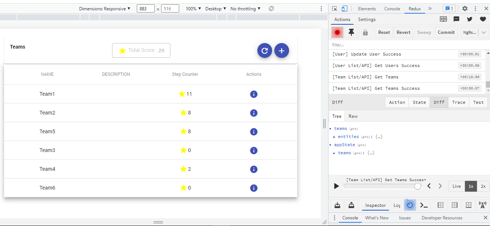
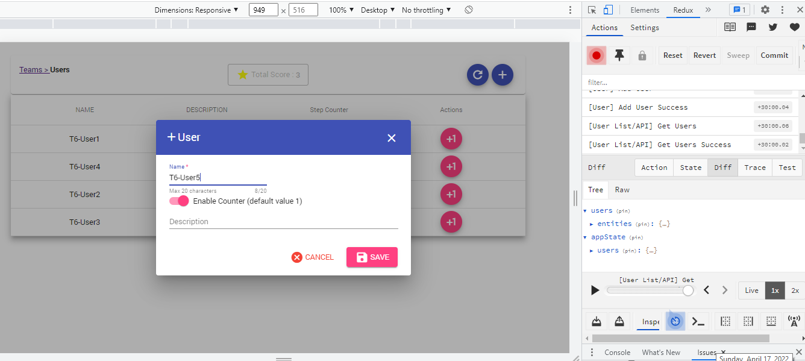

# Frontend

A modern Angular 13 implementation of the leaderboard assignment using **RxJS** and **NgRx** for reactive state management.

This version extends the original assignment with a more scalable frontend architecture and stronger separation of concerns while preserving the same business requirements: teams, users, counters, and leaderboard comparison.

---

## Built With

[](https://angular.io/)
[](https://www.typescriptlang.org/)
[](https://ngrx.io/)
[](https://rxjs.dev/)
[](https://material.angular.io/)
[](https://sass-lang.com/)
[](https://karma-runner.github.io/)
[](https://jasmine.github.io/)

---

## Overview

This frontend is a more advanced implementation of the leaderboard application, built with modern Angular practices.

It includes:

- reactive forms
- feature-based structure
- RxJS-driven API flows
- NgRx store/effects/selectors
- improved message and error handling
- reusable shared components and utilities

---

## Features

- Team leaderboard view
- Team detail view
- Add new team
- Add new user with step counter
- Increment user counters
- Reactive forms
- Shared models and interfaces
- State management with **NgRx**
- Side effects handled with **NgRx Effects**
- Selectors and reducers for predictable state updates
- Angular Material UI
- SCSS styling
- Unit testing with Jasmine and Karma
- Store DevTools integration

---

## Project Structure
```bash
app
├── core
│   └── page-not-found
├── leaderboard
│   ├── team
│   │   └── team-form
│   └── user
│       └── user-form
└── shared
├── component
│   └── toast
├── directive
├── model
├── pipe
├── service
├── store
│   ├── actions
│   ├── effects
│   ├── reducers
│   ├── selectors
│   └── states
├── support
└── url

assets
environments
styles
```
### Structure Notes

- **leaderboard**  
  Core feature area for team and user management

- **shared/store**  
  NgRx implementation including actions, reducers, effects, selectors, and state definitions

- **shared/service**  
  API and business interaction services

- **shared/component**  
  Reusable UI pieces such as toast notifications

---

## Run Locally

Install dependencies

bash
npm install

Start development server

bash
npm run start

Navigate to:

bash
http://localhost:4200/

> Make sure the backend server is running before using the application.

---

## Development

| Command | Description |
| :------ | :---------- |
| `npm run start` | Start the Angular 13 development server |
| `npm run build` | Build the application |
| `npm run watch` | Build in watch mode using development configuration |
| `npm run test` | Run unit tests with Karma |

---

## Technical Notes

- Built with **Angular CLI 13.3.2**
- Uses **TypeScript 4.6**
- Uses **RxJS 7**
- Uses **NgRx Store**, **Effects**, and **Store DevTools**
- Uses **Angular Material** and **SCSS**
- Includes improved reactive programming patterns compared with the Angular 8 version

---

## Architecture Diagram

The following diagrams show structure and UI examples:





---

## Why This Version Matters

Compared to the Angular 8 implementation, this version demonstrates:

- more scalable state handling
- clearer async data flow
- better maintainability for larger applications
- modern Angular architectural practices

It can be seen as an evolution of the same assignment into a more production-oriented frontend solution.
